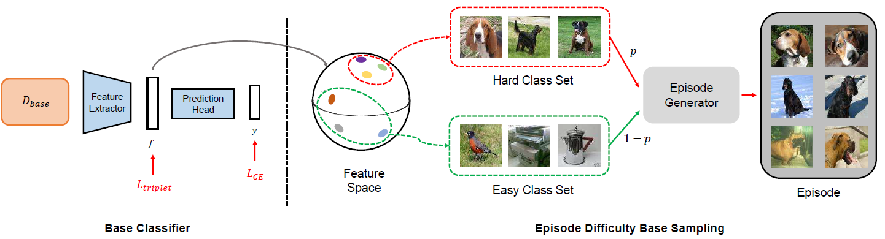
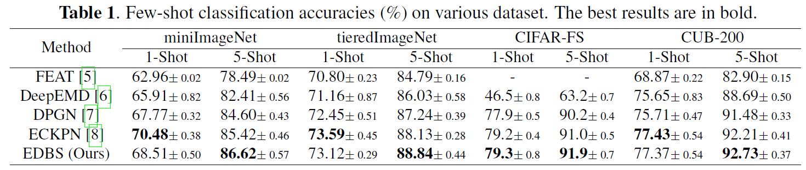
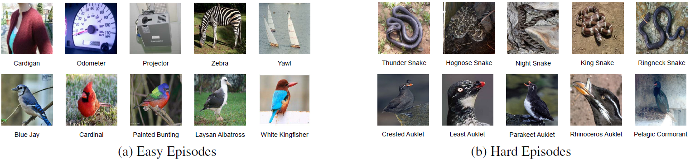

# EDBS

# [Episode Difficulty Based Sampling Method For Few-Shot Classification]

Hochang Rhee, Nam Ik Cho

## Environments
- Pytorch 1.7.0
- CUDA 10.2.89 & cuDNN 7.6.5
- Python 3.7.7

You can type the following command to easily build the environment.
Download 'edbs.yml' and type the following command.

```
conda env create -f ebds.yml
```

## Abstract
Most methods in few-shot learning adopt episodic training, where classes for generating episodes are randomly sampled. Here, most of the episodes are easily solvable, i.e., the dataset in terms of the episodes becomes biased towards easy ones. In this paper, we propose a novel sampling method named Episode Difficulty Based Sampling (EDBS) that aims to remove the dataset bias in terms of episode difficulty. We define the episode difficulty to be proportional to the similarity between the classes composing the episode. Then we determine an episode as easy or hard depending on their episode difficulty and design a balanced episode dataset in terms of the
difficulty. Through our EDBS, few-shot networks become less biased to the easy episodes and learn detailed features necessary for solving challenging episodes. Experiments demonstrate that our sampling method is widely applicable and achieves state-of-the-art performance in the benchmarks.

## Brief Description of Our Proposed Method
### Framework of our compresion scheme
<p align="center"></p>

The overall framework of our method. The base classifier is initially trained with dataset D_{base} to generate a feature space that has simialr-looking classes, close in terms of thhe feature distance. With the obtained feature space, we can determine a set of classes as easy or hard. Through p, the episode generator controls the ratio of easy and hard episodes used for training the few-shot network.


## Experimental Results

<p align="center"></p>

Few-shot classification accuracies on various dataset. The best results are in bold.

<p align="center"></p>

Visualization of generated easy and hard episodes. Each row shows the result for teiredImageNet and CUB200.

## Brief explanation of contents

```
|── experiments
    ├──> experiment_name 
         ├──> ckpt : trained models will be saved here
         └──> log  : log will be saved here
|── dataset
    ├──> dataset_name1 
         ├──> train
              ├──> class A : trainingg image of dataset_name1, class A should be saved here
              ├──> class B : trainingg image of dataset_name1, class B should be saved here
              ...
              └── class Z : trainingg image of dataset_name1, class Z should be saved here
         ├──> val   : validation images of dataset_name1 should be saved here (same format as train)
         └──> test  : test images of dataset_name1 should be saved here (same format as train)
    ├──> dataset_name2
         ├──> train : training images of dataset_name2 should be saved here
         ├──> val : validation images of dataset_name2 should be saved here
         └──> test  : test images of dataset_name2 should be saved here         
|── utils : files for utility functions
|── config.py : configuration should be controlled only here 
|── correlation.py : check correlation between classes
|── model_classifier.py : Classifier model for initial training
|── model.py : Few-shot classification model for training (MAML for this repository)
|── train.py : architecture of FDNet
|── test.py : training code
└── tripletloss.py : Code for triplet loss

```

## Guidelines for Codes

1. Check configurations from config.py

2. Run the following command for training  the network
```
python train.py --gpu_num=0 --N_way=5 --K_shot=5 --query_num=15 --evaluate_task=100  --experiment_name='default/' --dataset='miniImagenet/'
```

The trained model will be saved in the following directory : experiments/default/ckpt

We provide the code in the case for MAML / miniImagenet.

## Citation
If you use the work released here for your research, please cite this paper. (Will be added later)
